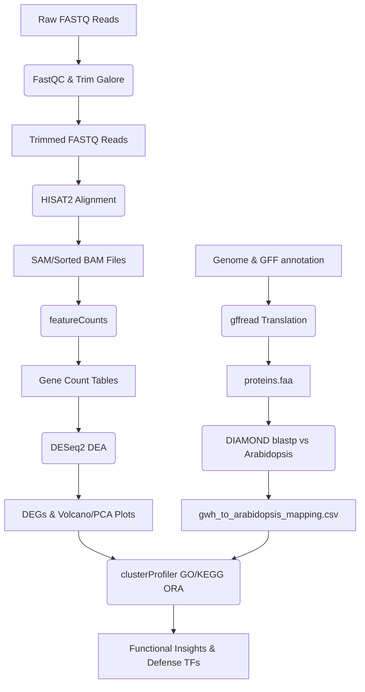
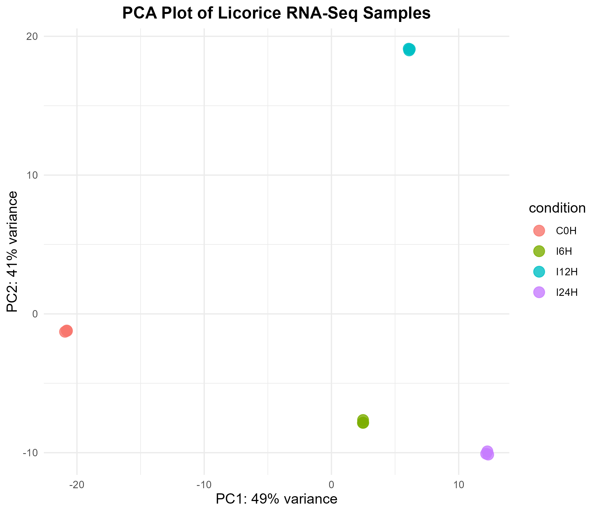
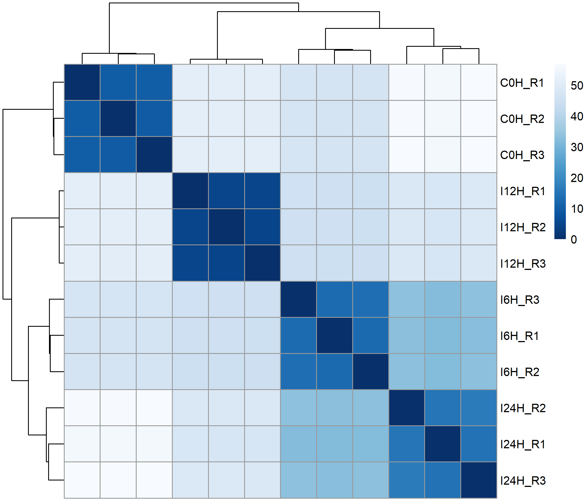
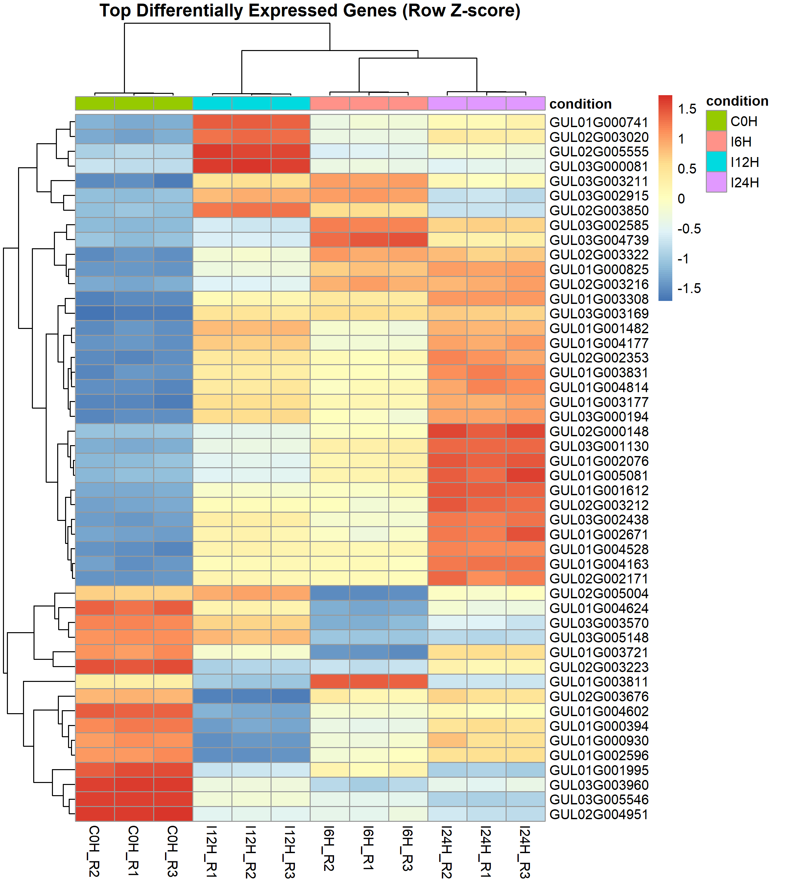
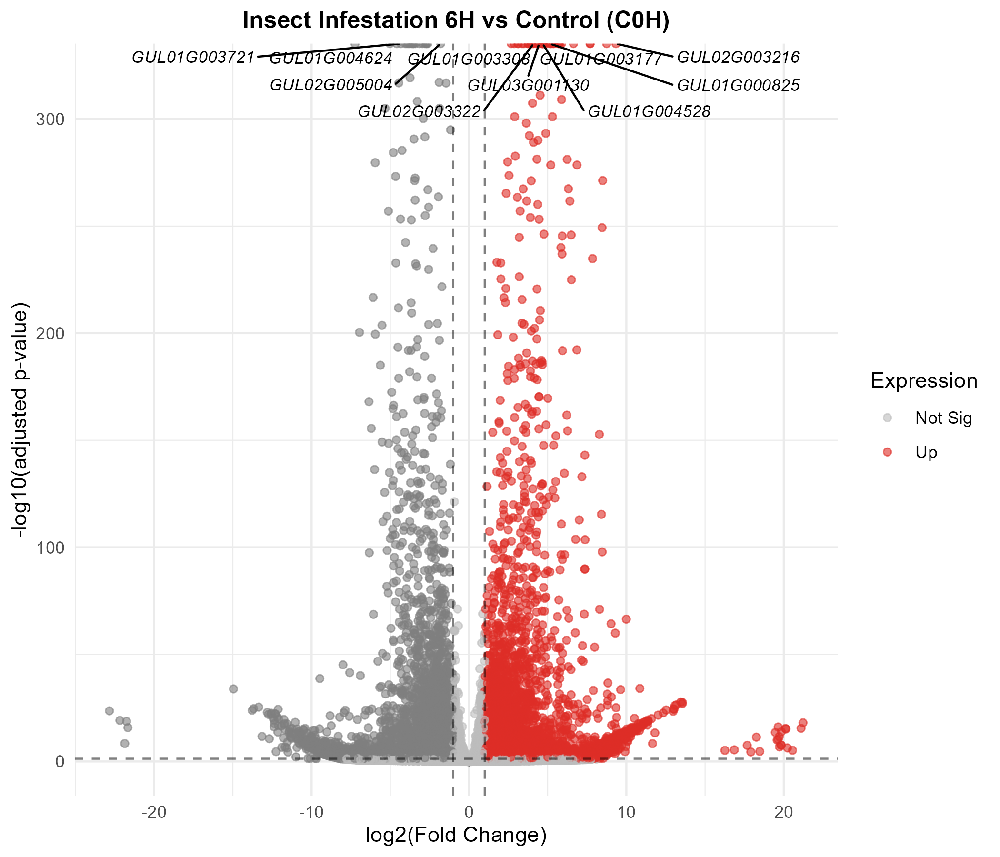
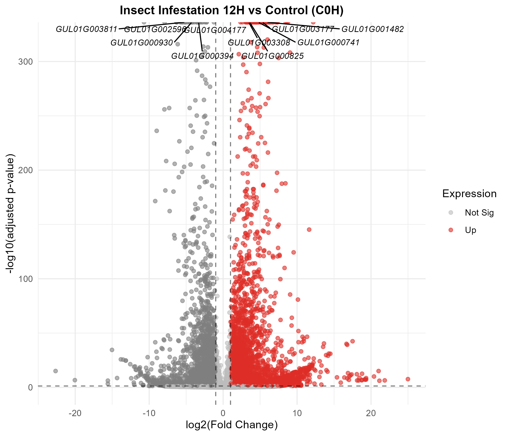
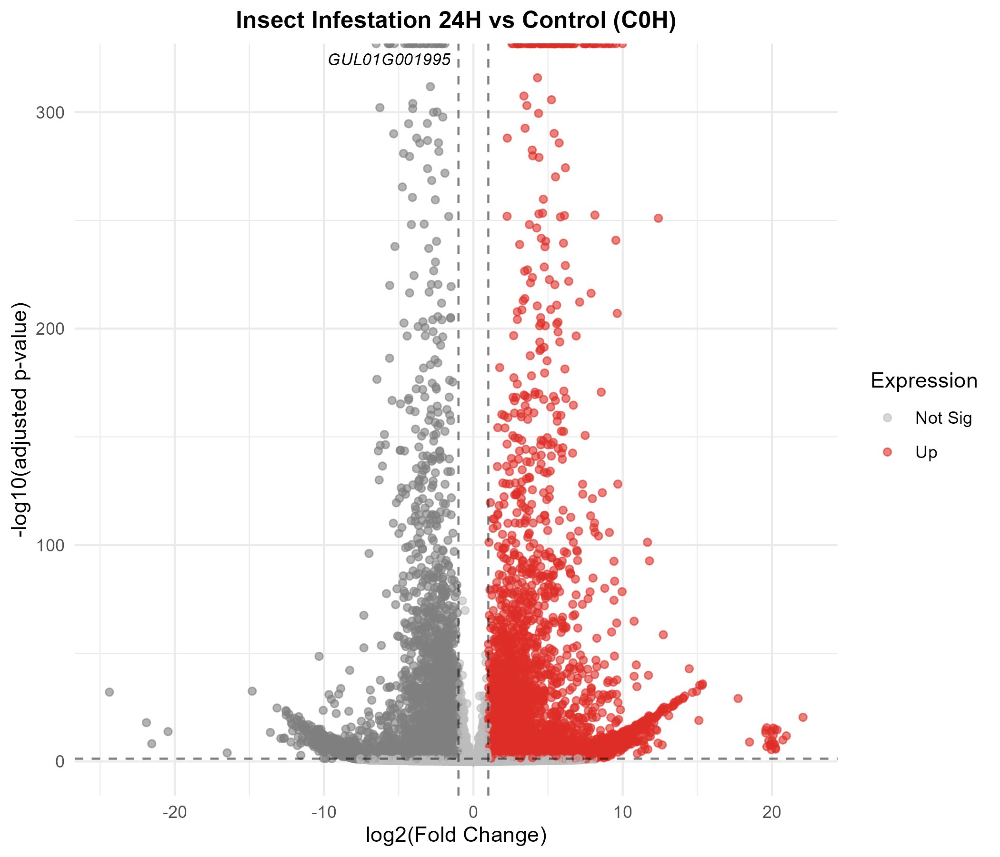
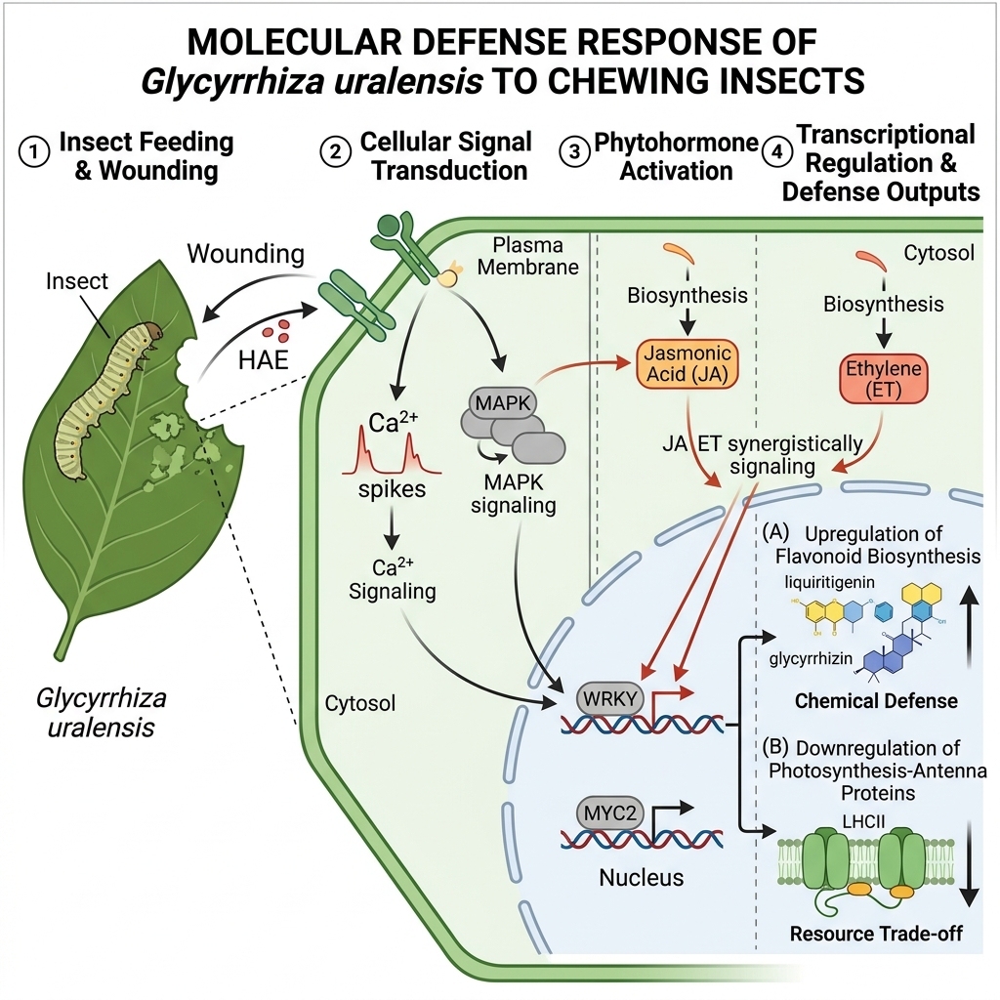

# Transcriptomic Analysis of Licorice (*Glycyrrhiza uralensis*) Response to Insect Infestation Using RNA-Seq

This repository contains the preprocessing, differential expression analysis, homology mapping, and downstream functional annotation pipeline for investigating the transcriptomic responses of licorice (*Glycyrrhiza uralensis*) leaves to chewing insect herbivory over a 24-hour timecourse.

---

## 1. Experimental Design & Datasets

Licorice leaf tissues were collected and sequenced (paired-end RNA-Seq) at four time points after insect infestation:
*   **Control (0 Hours):** `C0H_R1`, `C0H_R2`, `C0H_R3`
*   **Insect Treatment (6 Hours):** `I6H_R1`, `I6H_R2`, `I6H_R3`
*   **Insect Treatment (12 Hours):** `I12H_R1`, `I12H_R2`, `I12H_R3`
*   **Insect Treatment (24 Hours):** `I24H_R1`, `I24H_R2`, `I24H_R3`

**Total Samples:** 12 (3 biological replicates per group)  
**Reference Genome:** GWH *Glycyrrhiza uralensis* genome assembly (cultivar Manju).

---

## 2. Pipeline Workflow & Methodology



### Preprocessing & Alignment (WSL2 Ubuntu)
1.  **Quality Control:** Raw and trimmed read quality was verified using `FastQC` and aggregated via `MultiQC`.
2.  **Adapter Trimming:** Low-quality bases (Phred score < 20) and adapter sequences were removed using `Trim Galore` (wrapping `Cutadapt`).
3.  **Genome Alignment:** Clean reads were aligned against the licorice reference genome using `HISAT2` (pre-indexed using `hisat2-build`).
4.  **BAM Processing:** Aligned SAM files were converted, sorted, and indexed using `SAMtools`.
5.  **Gene Quantification:** Transcript abundance was quantified using Subread `featureCounts` based on the GWH `annotation.gff` file.

### Downstream Statistical Analysis (Windows Host R)
6.  **Differential Expression Analysis (DEA):** Performed negative binomial modeling of raw gene counts using `DESeq2`. Significantly Differentially Expressed Genes (DEGs) were identified using standard cutoffs of $\text{padj} < 0.05$ (BH adjusted) and $|\log_2\text{FoldChange}| \ge 1.0$ (minimum two-fold change) to control false-positive rates.
7.  **Homology Mapping:** Extracted licorice protein sequences from the genome assembly using `gffread` and mapped them to *Arabidopsis thaliana* (TAIR10) homologs using `DIAMOND` blastp, strictly enforcing an E-value threshold $\le 10^{-5}$, percent identity $\ge 30\%$, and selecting the single best-hit per query gene based on bitscore to construct a high-confidence 1-to-1 ortholog mapping.
8.  **Functional Enrichment:** Performed Gene Ontology (GO - BP, MF, CC) and KEGG pathway over-representation analysis (ORA) using `clusterProfiler` with Benjamini-Hochberg (BH) FDR control ($\text{padj} < 0.05$ and $\text{qvalue} < 0.05$). KEGG enrichment was performed using the Arabidopsis homolog mapping due to the absence of species-specific KEGG annotation for *Glycyrrhiza uralensis*.
9.  **Defense Gene Annotation:** Annotations were retrieved from `org.At.tair.db` to isolate putative homologs of defense transcription factors, hormone signaling (JA, SA, ET), and secondary metabolism pathways.

---

## 3. Key Findings & Biological Insights

### Differential Expression Summary
We identified thousands of genes dynamically regulated during insect infestation:
*   **6 Hours:** 8,629 total DEGs (4,305 Up / 4,324 Down) | 7,452 Mapped Homologs | 1,177 Unmapped Novel DEGs (13.64%)
*   **12 Hours:** 7,818 total DEGs (4,379 Up / 3,439 Down) | 6,803 Mapped Homologs | 1,015 Unmapped Novel DEGs (12.98%)
*   **24 Hours:** 9,819 total DEGs (4,967 Up / 4,852 Down) | 8,510 Mapped Homologs | 1,309 Unmapped Novel DEGs (13.33%)

*Note: Unmapped DEGs lack high-confidence Arabidopsis counterparts and represent potential novel, legume-specific, or species-specific defense genes in G. uralensis.*

### Enriched Biological Pathways
*   **Induction of Flavonoid Biosynthesis (`ath00941`):** Robustly enriched in up-regulated genes across all timepoints. Licorice plants actively synthesize specialized bioactive flavonoids (phytoalexins) for chemical defense.
*   **Ribosome Translation (`ath03010`):** Enriched in up-regulated genes, showing a massive increase in translation capacity to produce defense-related enzymes and signaling components.
*   **Photosynthesis Reorganization (`ath00195` & `ath00196`):** Photosynthetic genes were dynamically regulated to manage the metabolic and energetic costs of the active defense response.
*   **Negative Feedback on Hormones (`ath00592`):** Down-regulation of alpha-linolenic acid metabolism (precursor of Jasmonic Acid) at later hours points to tight homeostatic control on defense hormones.

### Defense Gene Counts

| Functional Group | I6H vs C0H | I12H vs C0H | I24H vs C0H |
| :--- | :---: | :---: | :---: |
| **TF: WRKY** | 132 | 99 | 120 |
| **TF: AP2/ERF** | 119 | 87 | 103 |
| **TF: NAC** | 61 | 50 | 63 |
| **TF: bHLH** | 41 | 45 | 56 |
| **TF: bZIP** | 35 | 29 | 42 |
| **TF: MYB** | 11 | 10 | 8 |
| **Hormone: Jasmonic Acid** | 120 | 126 | 130 |
| **Hormone: Ethylene** | 101 | 79 | 107 |
| **Hormone: Salicylic Acid** | 74 | 54 | 78 |
| **Secondary Metabolism (Flavonoids)** | 86 | 106 | 114 |
| **ROS Scavenging / Redox** | 38 | 42 | 47 |

Detailed annotated lists of defense genes (`results/key_defense_genes_*.csv`) and expression fold changes of representative candidate genes (`results/table2_representative_defense_genes.csv`) are saved in the results directory.

### Key Visualizations

The output plots generated by this pipeline are saved in the `results/` directory:

#### 1. Sample Quality Control & Replicate Clustering (PCA & Heatmap)
PC1 accounts for 56% of total variance and separates the early-stage samples (C0H and I6H) from the mature-stage samples (I12H and I24H). Biological replicates cluster tightly together, showing high experimental reproducibility.
<p align="center">
  
  
</p>

#### 2. Global Transcriptomic Reprogramming (Volcano Plots & Top DEGs Heatmap)
Thousands of genes are dynamically regulated across the timecourse, with massive up-regulation of defense pathways and down-regulation of primary growth pathways.
<p align="center">
  
</p>
<p align="center">
  
  
  
</p>

#### 3. Proposed Biological Response Model
Timeline of the coordinated defense response, including early signaling activation, phytohormone transcription factor dynamics, potential defense metabolite outputs (flavonoids), and energetic trade-offs.
<p align="center">
  
</p>

---

## 4. Repository Directory Structure

```text
├── .gitignore                   # Excludes raw/BAM sequences and IDE temp files
├── README.md                    # Project documentation
│
├── deseq2_analysis.R            # Step 1 R script: DEA and QC visualizations
├── go_kegg_enrichment.R          # Step 3 R script: GO & KEGG enrichment
├── extract_key_genes.R          # Step 4 R script: Defense gene annotation
│
├── counts/                      # Input count files
│   ├── C0H_R1_counts.txt
│   └── ... (12 files)
│
├── metadata/
│   └── sample_info.csv          # Sample metadata (sample, condition)
│
├── results/                     # OUTPUT DATA
│   ├── I6H_vs_C0H_all.csv       # Complete differential stats
│   ├── I6H_vs_C0H_sig_DEGs.csv  # Filtered significant DEGs
│   ├── (repeated for 12H, 24H)
│   │
│   ├── gwh_to_arabidopsis_mapping.csv # Mapped homologs
│   ├── key_defense_genes_*.csv  # Labeled defense genes
│   │
│   ├── go_*_*.csv               # Enriched GO term CSVs
│   ├── kegg_*.csv               # Enriched KEGG pathway CSVs
│   │
│   ├── pca_plot.png             # PCA Plot
│   ├── sample_distance_heatmap.png # Sample correlation heatmap
│   ├── volcano_*.png            # Volcano plots
│   ├── deg_heatmap.png          # Expression heatmap of top DEGs
│   ├── go_*_dotplot_*.png       # GO enrichment dotplots
│   └── kegg_dotplot_*.png       # KEGG enrichment dotplots
│
└── scripts/
    └── run_rnaseq_pipeline.sh   # Bash script: Raw reads to featureCounts (WSL)
```

---

## 5. Setup & Usage Instructions

### Prerequisites
1.  **R & RStudio (Windows/Host):** Install packages:
    ```R
    install.packages(c("ggplot2", "ggrepel", "pheatmap", "RColorBrewer", "BiocManager"))
    BiocManager::install(c("DESeq2", "clusterProfiler", "org.At.tair.db", "enrichplot"))
    ```
2.  **Conda (WSL Linux):** Tools installed:
    *   `FastQC`, `Trim Galore`, `HISAT2`, `SAMtools`, `featureCounts` (Subread), `gffread`, `DIAMOND`.

### Running the Downstream R Pipeline
If running in Windows R, make sure your working directory is set to this project directory (using network shares for WSL files):
1.  **Run DEA:**
    ```powershell
    Rscript deseq2_analysis.R
    ```
2.  **Run GO/KEGG Enrichment:**
    ```powershell
    Rscript go_kegg_enrichment.R
    ```
3.  **Annotate Key Genes:**
    ```powershell
    Rscript extract_key_genes.R
    ```
